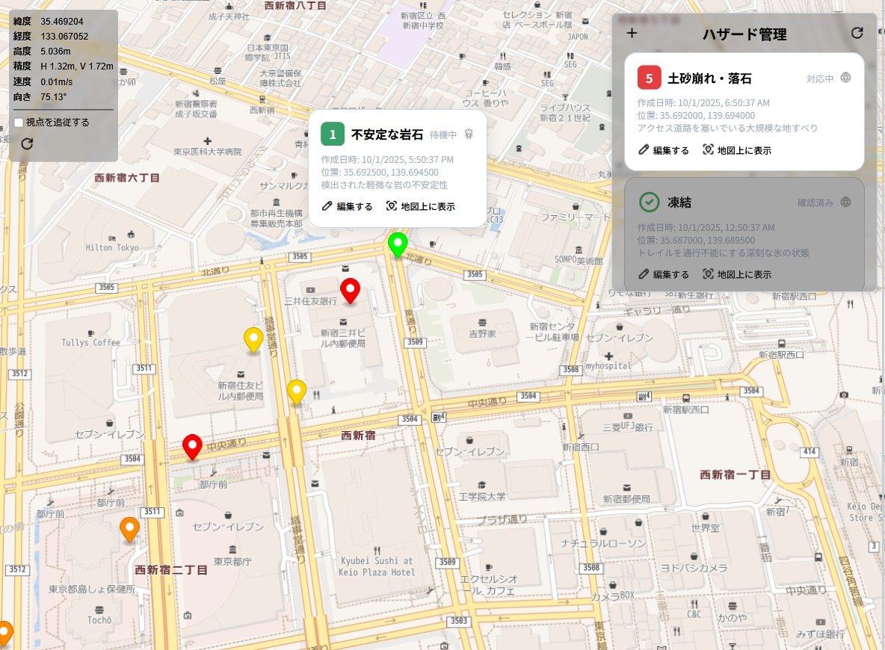

import genesisWalkVideo from "./genesis-walk.mp4";

第36回全国高専プログラミングコンテストの課題部門で作った、六脚ロボットによる山間部・森林環境監視システムです。
短時間豪雨やクマの生活圏への侵入などで、山間部や森林を安全に確認する必要性が高まっていることを背景に、人が立ち入りにくい場所をロボットで巡回・調査することを目指しました。

このシステムは、フロントエンド、APIサーバー、ロボットの3つで構成されています。
ロボット側で取得した位置情報、カメラ映像、LiDARの点群データ、ハザード情報をWebアプリから確認できるようにしました。

## できること

- 地図上でロボットの現在位置と向きを確認
- ロボットに搭載したカメラ映像のリアルタイム表示
- GPS情報、接続状態、ログなどの監視
- 土砂崩れ、落石、倒木などのハザード管理
- LiDARから取得した点群データの表示と差分解析
- 手動走行と自動走行ルートの設定

## 担当したこと

- ロボットの位置情報やハザード情報を管理するWeb APIバックエンド
- 地図上のハザード管理に使うデータ設計
- Genesisとrsl_rlを使った六脚ロボットの歩行制御モデルの学習

Webアプリでは、地図、カメラ、GPS、ロボット情報、ログなどをパネルとして配置できるダッシュボードを用意しました。
地図画面では、ロボットの現在位置を表示し、発見したハザードを地図上に登録・更新できます。
ハザードは種類や状態を持つデータとして管理し、現地で見つけた異常をあとから確認しやすい形で保存できるようにしています。

歩行制御では、深層強化学習による走行にも取り組みました。
強化学習ライブラリにはrsl_rl、シミュレーション環境にはGenesisを使っています。
モーターの位置や機体の状態をもとにエージェントが行動を出力し、報酬を使って歩行を学習する構成です。
自前のGPUで学習させました。
六脚なことや閉リンク機構があったので大変でした。

モーターをすべて動かすに至らなかったので、実際にロボットを動かすことはできていません。

<video class="mt-6 w-full rounded-2xl" controls playsinline preload="metadata">
  <source src={genesisWalkVideo} type="video/mp4" />
  お使いのブラウザは動画再生に対応していません。
</video>
